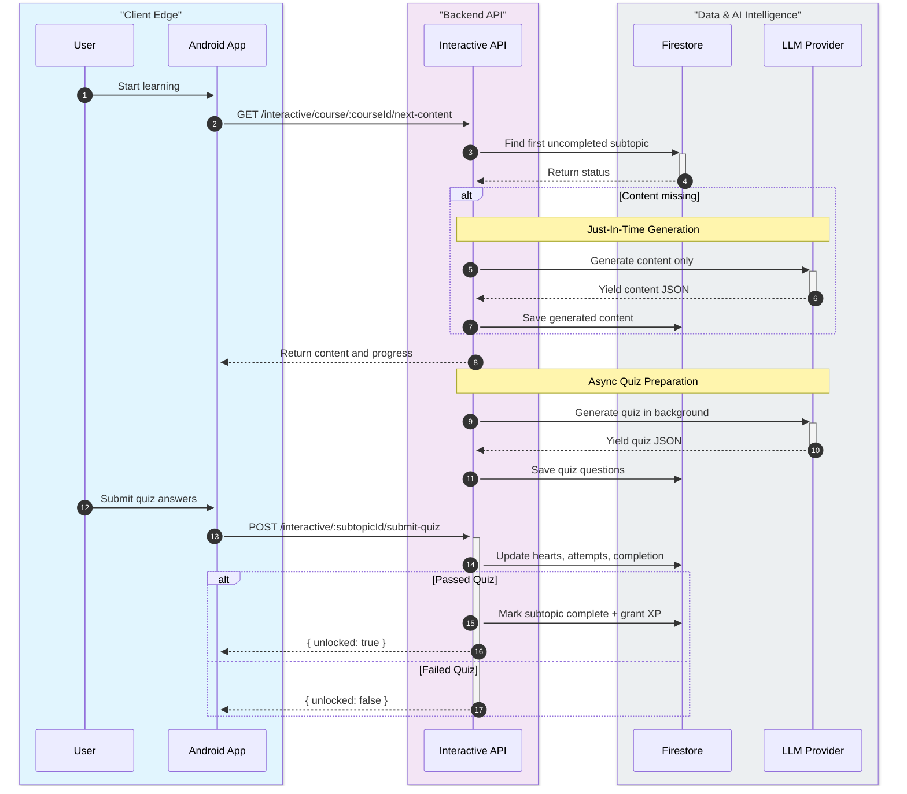
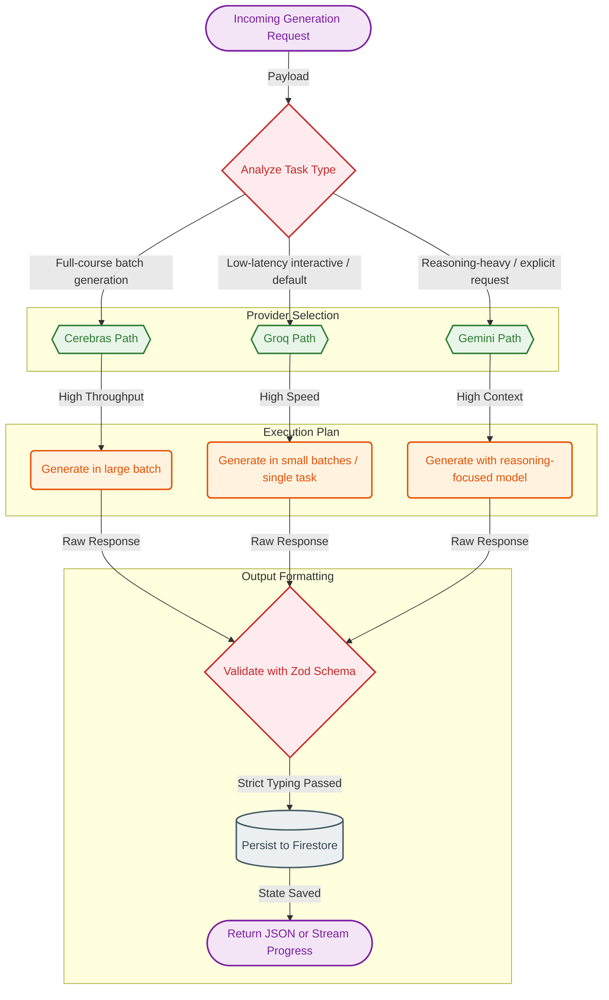
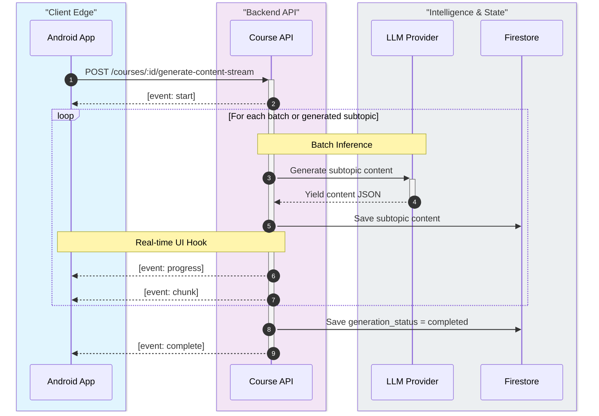
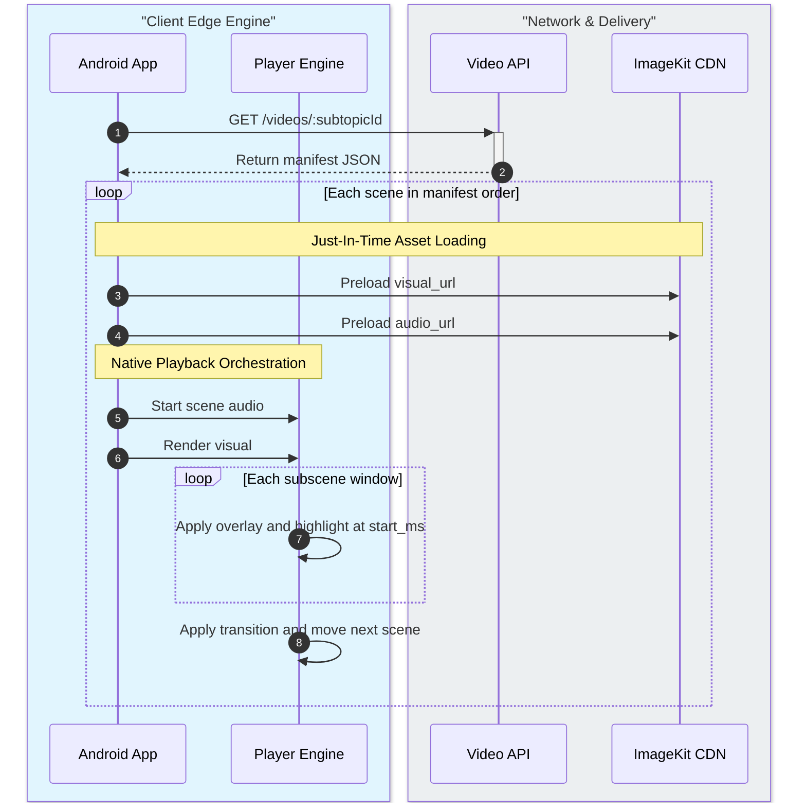
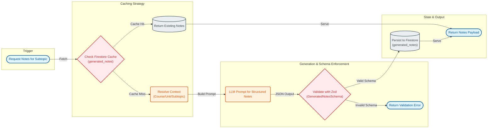
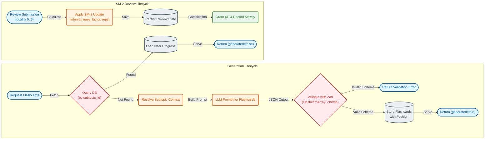
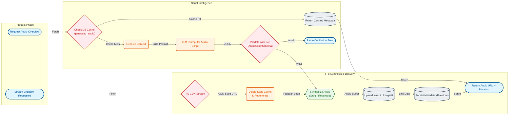

# UpSkill AI - Architecture Diagrams

## 1) Full System Architecture (Client + Backend)

  

## 2) Interactive Learning and Quiz-Gated Unlock Flow

  

Text version (Mermaid)

## 3) LLM Routing Logic by Task Type

  

Text version (Mermaid)

## 4) SSE Streaming Course Generation Lifecycle

  

Text version (Mermaid)

## 5) Explanation Video Manifest-First Pipeline

  

Text version (Mermaid)

```mermaid
graph LR
    %% Styles
    classDef action fill:#f3e5f5,stroke:#7b1fa2,stroke-width:2px,color:#7b1fa2;
    classDef logic fill:#fff3e0,stroke:#e65100,stroke-width:2px,color:#e65100;
    classDef storage fill:#eceff1,stroke:#455a64,stroke-width:2px,color:#37474f;
    classDef primary fill:#e1f5fe,stroke:#01579b,stroke-width:2px,color:#01579b;

    %% Nodes
    A1(["Subtopic Content"])
    B1("Script Generation")
    C1("Scene Planning")
    D1{"Scene Type"}

    subgraph Visual_Pipeline ["Asset Generation"]
        E1("Image Provider Pipeline")
        F1("SVG Generation <br/>(Diagram/Code/Timeline)")
        H1("SVG to PNG Render")
    end

    subgraph Audio_Pipeline ["Voice Generation"]
        I1("TTS per Script Chunk")
    end

    G1[("Upload Visual to ImageKit")]
    J1[("Upload Audio to ImageKit")]
    
    K1("Transition Planning")
    L1("Build Manifest JSON")
    M1[("Firestore <br/>(video_manifests)")]
    N1(["Client Playback Engine"])

    %% Flow
    A1 -- "Input" --> B1
    B1 -- "Parsed Script" --> C1
    C1 -- "Evaluate" --> D1

    D1 -- "Illustration" --> E1
    D1 -- "Structural" --> F1
    
    F1 -- "Compile" --> H1
    E1 -- "Buffer" --> G1
    H1 -- "Buffer" --> G1

    C1 -- "Text to Speech" --> I1
    I1 -- "Audio Buffer" --> J1

    G1 -- "URLs" --> K1
    J1 -- "URLs" --> K1
    
    K1 -- "Assemble Timing" --> L1
    L1 -- "Save Document" --> M1
    M1 -- "Serve" --> N1

    %% Classes
    class A1,N1 primary;
    class B1,C1,K1,L1 action;
    class D1 logic;
    class E1,F1,H1,I1 logic;
    class G1,J1,M1 storage;
```

## 6) Client-Side Manifest Playback Timeline

  

Text version (Mermaid)

## 7) Notes Generation Pipeline

  

Text version (Mermaid)

## 8) Flashcards Generation and Review Pipeline

  

Text version (Mermaid)

## 9) Audio Overview Generation Pipeline

  

Text version (Mermaid)

