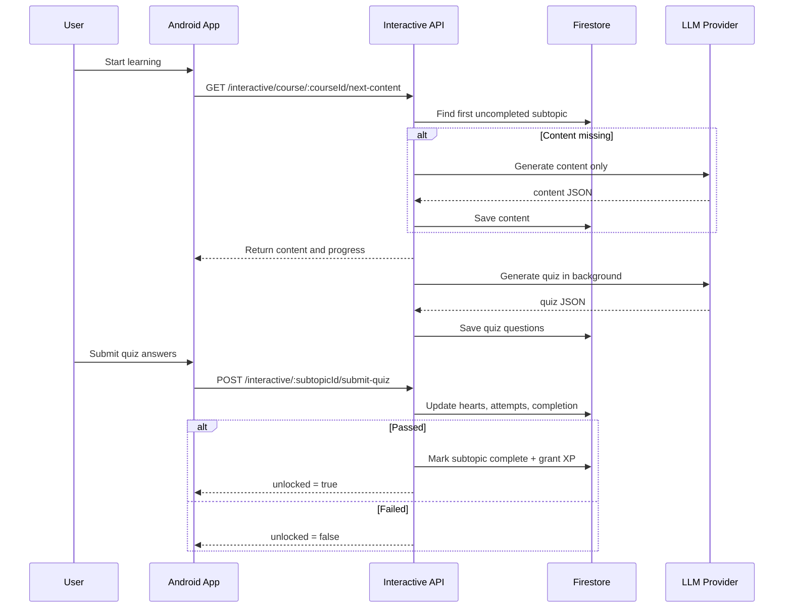
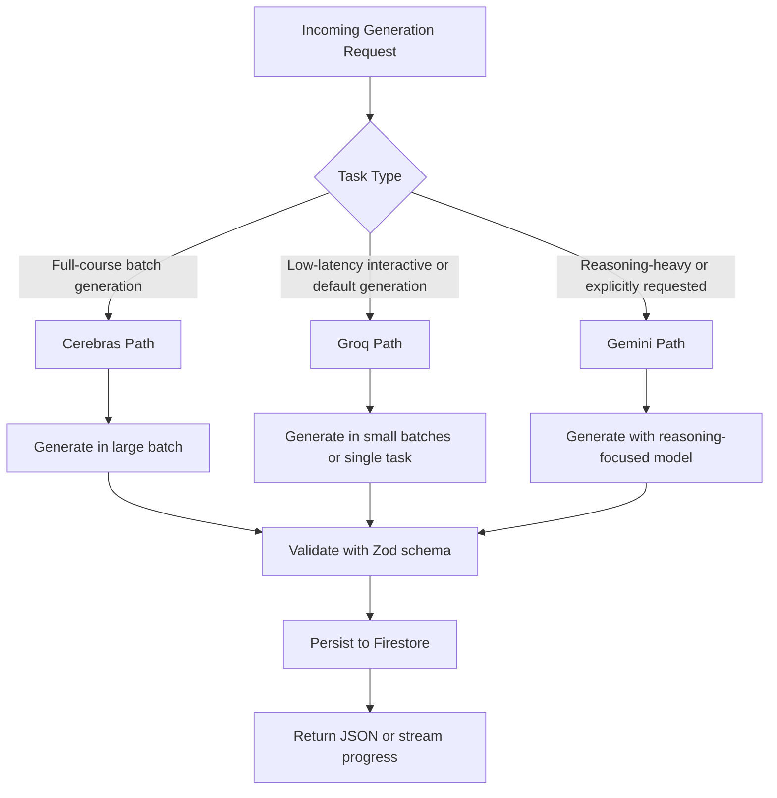
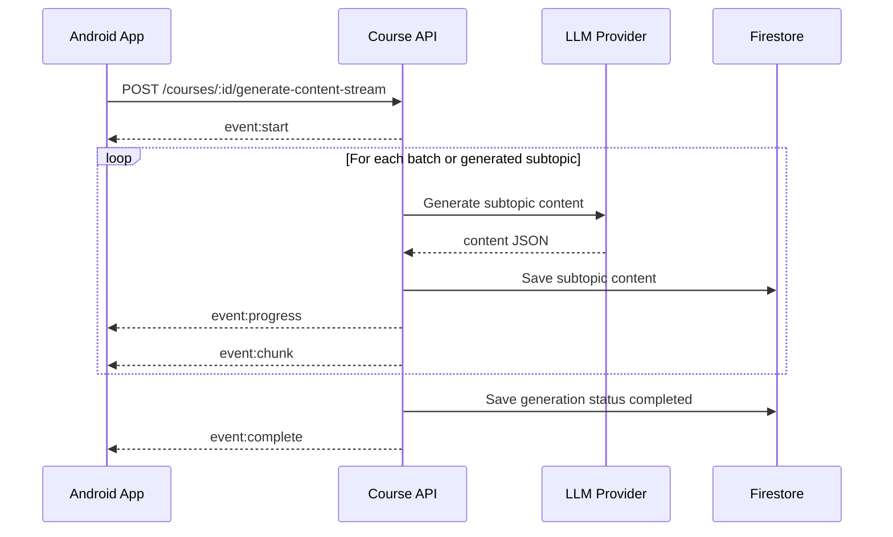
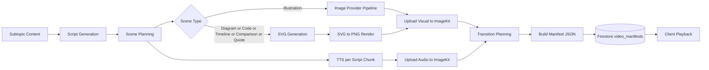
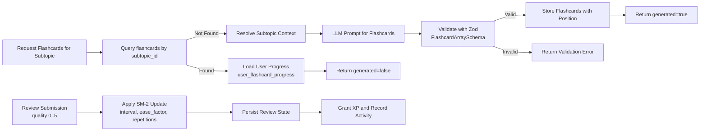
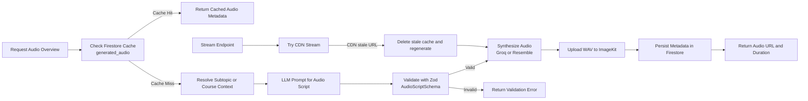
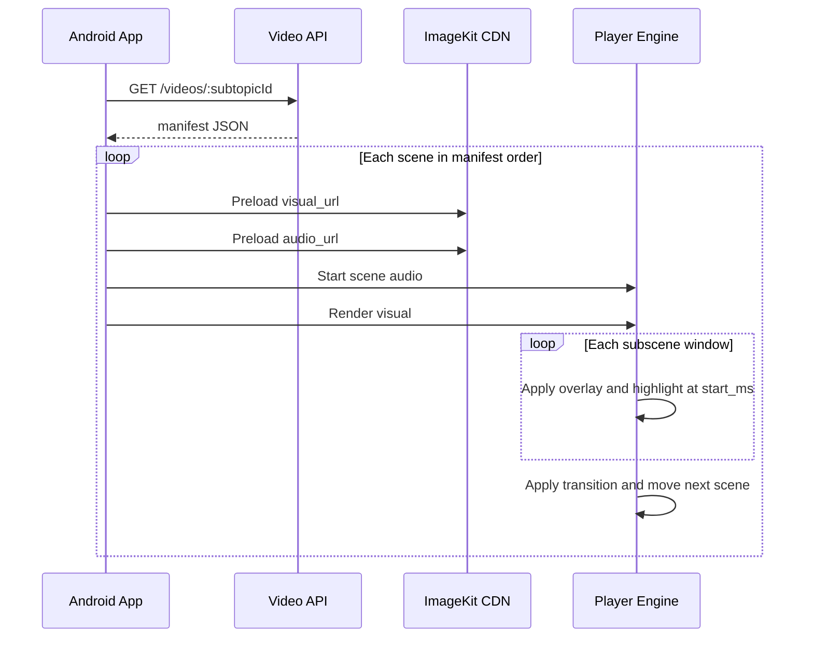
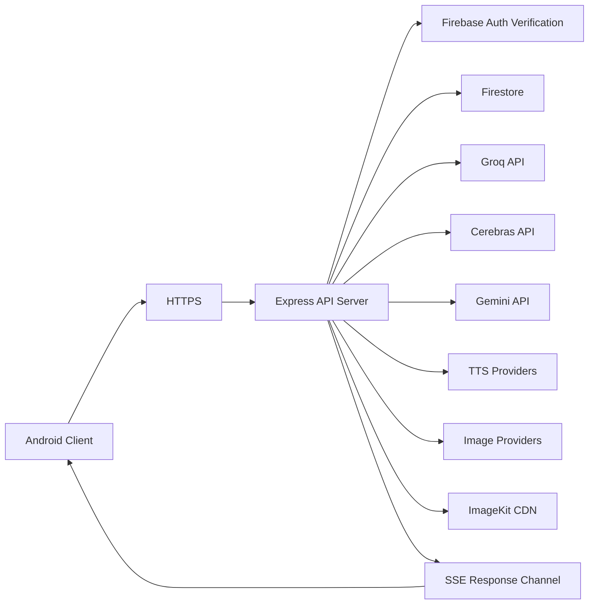

# UpSkill AI - Architecture Diagrams

## 1) Full System Architecture (Client + Backend)
<p align="center">
  
</p>


## 2) Interactive Learning and Quiz-Gated Unlock Flow



## 3) LLM Routing Logic by Task Type



## 4) SSE Streaming Course Generation Lifecycle



## 5) Explanation Video Manifest-First Pipeline



## 6) Notes Generation Pipeline

```mermaid
flowchart LR
    A[Request Notes for Subtopic] --> B[Check Firestore Cache\ngenerated_notes/{subtopicId}]
    B -->|Cache Hit| C[Return Existing Notes]
    B -->|Cache Miss| D[Resolve Course, Unit, Subtopic Context]

    D --> E[LLM Prompt for Structured Notes]
    E --> F[Validate with Zod\nGeneratedNotesSchema]
    F -->|Valid| G[Persist to Firestore\ngenerated_notes]
    F -->|Invalid| H[Return Validation Error]

    G --> I[Return Notes Payload]
    C --> I
```

## 7) Flashcards Generation and Review Pipeline



## 8) Audio Overview Generation Pipeline



## 9) Client-Side Manifest Playback Timeline



## 10) Data Model Map for Learning State

```mermaid
flowchart TB
    U[(users)] --> UC[(user_courses)]
    U --> USP[(user_subtopic_progress)]

    C[(courses)] --> UN[(courses/{id}/units)]
    UN --> ST[(subtopics)]

    ST --> SQ[(subtopic_questions)]
    ST --> FL[(flashcards)]
    ST --> NT[(generated_notes)]
    ST --> AU[(generated_audio)]
    ST --> VM[(video_manifests)]

    C --> CG[(course_generation_status)]
    C --> CPS[(course_public_stats)]
```

## 11) Deployment and Runtime Topology


